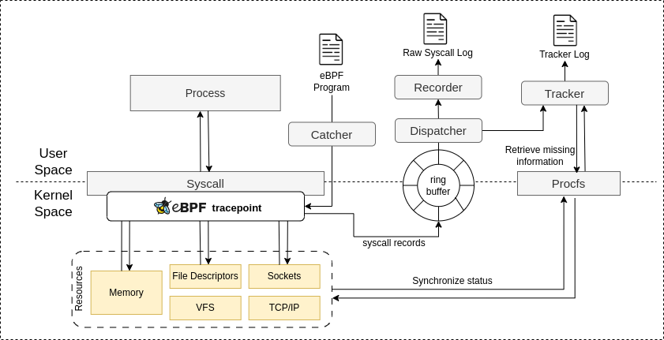

## developer documentation

BackTrack draws from the structure of libbpf-bootstrap, reusing its eBPF loading and userspace scaffolding.  All core logic is located in the backtrack/ directory and organized into four key modules:

**catcher** captures selected system calls using eBPF probes in kernel space and pushes them to a ring buffer.

**dispatcher** receives events from the ring buffer and forwards them to both the **tracker** and **recorder**.

**tracker** maintains runtime context (e.g., process hierarchy, file descriptors) and outputs **tracker logs** for provenance graph construction.

**recorder** formats **raw syscall events** from catcher into JSON logs. 

> The recorder does not perform semantic analysis and is not discussed in the paper “BackTrack: Bridging Gaps in Audit Logging for Reliable Provenance.”

---

**Note:** This developer documentation is a work in progress and will be updated with more details soon.

